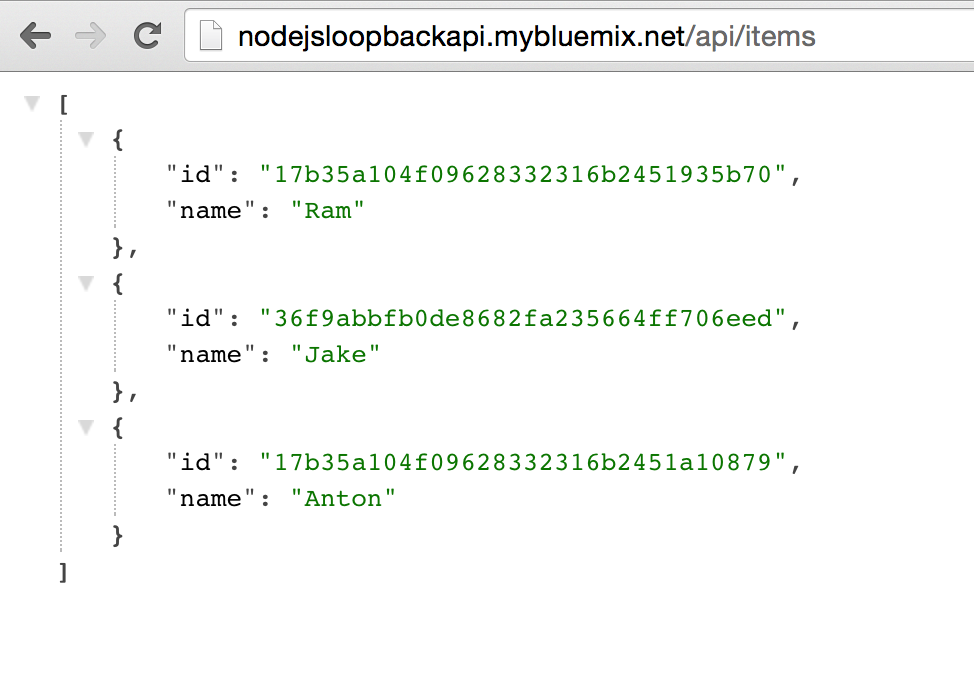
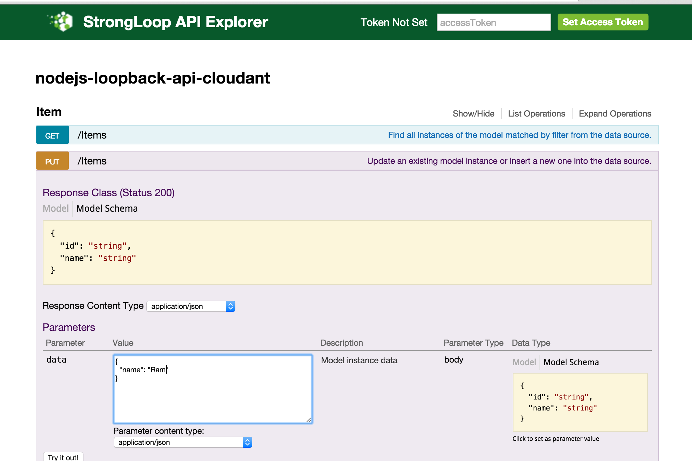

# nodejs-loopback-api-cloudant Overview

A simple API using StrongLoop Loopback backed by a Cloudant database. Create an RESTful API in minutes and Create, Read, Update and Delete (CRUD) data, complete with a swagger dashbaord.

This projects lets you run your loopback node.js application on Bluemix with a Cloudant database

[](https://bluemix.net/deploy)





This application is designed to be used as a microservice. You can reuse this application in combination with to other application(s) to manage any json data. For example, you might have a front end UI application written in any language and you can use this API as your backend. You can also use this application as part of your mobile solution. 

## Let's get started!
### Option 1: Start from this repo
1. If you do not already have a Bluemix account, [sign up here][bluemix_signup_url]

2. Download and install the [Cloud Foundry CLI][cloud_foundry_url] tool

3. Clone the app to your local environment from your terminal using the following command:

  ```
  git clone https://github.com/IBM-Bluemix/nodejs-loopback-api-cloudant.git
  ```

4. `cd` into this newly created directory

5. Open the `manifest.yml` file and change the `host` value to something unique.

  The host you choose will determinate the subdomain of your application's URL:  `<host>.mybluemix.net`

6. Connect to Bluemix in the command line tool and follow the prompts to log in

  ```
  $ cf api https://api.ng.bluemix.net
  $ cf login
  ```

7. Create the Cloudant service in Bluemix

  ```
  $ cf create-service cloudantNoSQLDB Shared loopback-db
  ```

11. Push the app to Bluemix.

  ```
  $ cf push
  ```

And voila! You now have your very own REST API! at YOURAPPNAME.mybluemix.net/api/Items . You can use the API Explorer to easily insert, delete, or update items: YOURAPPNAME.mybluemix.net/explorer

### Option 2: Start from scratch! Develop locally and push to Bluemix (recommended)

Open your teminal and follow the steps below:
```
npm install -g strongloop
slc loopback
? What's the name of your application? myLoopbackAPI
? Enter name of the directory to contain the project: myLoopbackAPI

cd myLoopbackAPI

npm install loopback-connector-cloudant --save

slc loopback:model
? Enter the model name: Item
? Select the data-source to attach Item to: db (memory)
? Select model's base class (Use arrow keys) ❯ PersistedModel 
? Expose Item via the REST API? (Y/n) Y
? Custom plural form (used to build REST URL): Items
? Common model or server only? (Use arrow keys) common
? Property name: name
? Property type: (Use arrow keys) string
? Required? Y
<enter> when done
```
You're API is ready, but its currently using an in-memory database. If you restart your application, all data will be lost! Let's fix that by using a Cloudant database from Bluemix. Cloudant is a NoSQL database.
#### Use Cloudant Database

Update server/datasources.json to just:
```
{ }
```
Create the file server/datasources.local.js and add this code:
```
var http = require('http');
var request = require('request');

//Local Development
//Enter your Cloudant URL here. Get this from your Bluemix Cloudant service by clicking on "Show Credentials" or "Service Credentials".
var url = "PUT_URL_HERE";
var databaseName = "mydb"; //You need to log into Cloudant Dashbaord and create this database

//Running on Bluemix. Gets the Cloudant credentials from VCAP_SERVICES env variable
if(process.env.VCAP_SERVICES){
	var vcap_services = JSON.parse(process.env.VCAP_SERVICES);
	url = vcap_services.cloudantNoSQLDB[0].credentials.url;
}

//Create the database (mydb) if it doesn't exist.
request.put(url + "/" + databaseName).on('error', function(err) {
    console.log("ERROR CREATING DATABSE: " + err);
  })

module.exports = {
  "db": {
	  "connector": "cloudant",
	  "url": url,
	  "database": databaseName
	}
};
```
Create a Cloudant database service in Bluemix UI.

Back in the Bluemix UI, click on *Service Credentials* and generate credentials


Copy the `url` field from credentials to server/datasources.local.js
```
var url = "PUT_URL_HERE";
```
Next, install some dependencies:
```
npm install request --save
```
Start the server!
`node .` from your myLoopbackAPI directory

Your REST API is available at: http://0.0.0.0:3000/api/Items
Your API Explorer API at http://0.0.0.0:3000/explorer

#### Push to Bluemix
We don't want to push the `node_modules` folder to Bluemix. So, lets create a .cfignore file
From the myLoopbackAPI folder:
```
echo node_modules >> .cfignore
```
Then, Push to Bluemix.
```
cf push PickAName
```
This will fail because it needs a Cloudant database.

Go to your Bluemix UI, click on your application, `Bind a Service` and choose the Cloudant database you chose before. You'll be prompoted to restage. Click Yes. After that completes:

Your REST API is available at: http://PickAName.mybluemix.net/api/Items
Your API Explorer API at http://PickAName.mybluemix.net/explorer

## Troubleshooting

The primary source of debugging information for your Bluemix app is the logs. To see them, run the following command using the Cloud Foundry CLI:

  ```
  $ cf logs nodejsLoopbackAPI --recent
  ```
For more detailed information on troubleshooting your application, see the [Troubleshooting section](https://www.ng.bluemix.net/docs/troubleshoot/tr.html) in the Bluemix documentation.

## Contribute
We are more than happy to accept external contributions to this project, be it in the form of issues and pull requests. If you find a bug, please report it via the [Issues section][issues_url] or even better, fork the project and submit a pull request with your fix! Pull requests will be evaulated on an individual basis based on value add to the sample application.

